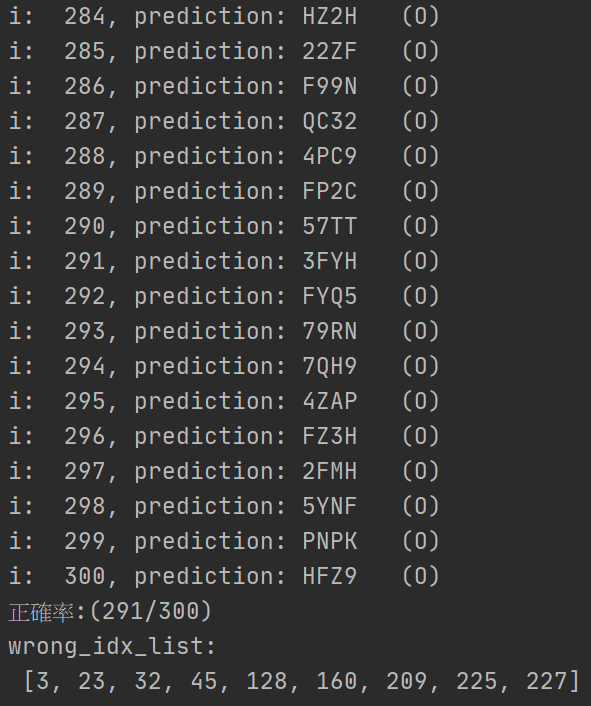

# 台灣高鐵驗證碼辨識

### *免責聲明*
### *!!--此專案為純學術研究之用，請勿違法使用於大量自動訂票。--!!*

### 說明
光學字元辨識(OCR)是數位影像處理這一研究領域的子領域，此專案，我們嘗試訓練卷積神經網路(CNN)有效地自動獲取影像特徵，使分類器能準確做出4碼英/數字的預測；起初，手動標籤1,000張圖做為訓練資料，從而得出參數模型，再藉由此模型上線預測藉以蒐集訓練資料，隨著蒐集到的訓練資料擴增，再調整類神經網路的參數數量，反覆這過程，最終以10,000筆數據訓練得參數模型，上線測試模型的準確率來到97%

類神經網路架構圖如下：

### 檔案列表
| # | 檔名 | 說明 |
|---|---|---|
| 1 | image_preprocessing.ipynb | 此檔揭示此專案之影像預處理的做法與參數嘗試的效果。 |
| 2 | train_colab.ipynb | 此為訓練模型之用的程式碼。 |
| 3 | crawl_imgs.py | 上線執行，驗證該參數模型的準確率，並存下圖檔。 |
### 操作步驟
1. 上傳資料集(THSR_captcha_12000.zip) 與 train_colab.ipynb 至 Google Colab。
1. 執行該Colab(執行前可開啟Google Colab提供GPU、TPU運算資源，加快運算速度)，執行過程約需30mins。
1. 下載saved_model資料夾供crawl_imgs.py使用。

* 注: THSR_captcha_12000.zip 該壓縮檔裡頭為一資料夾名為THSR_captcha，資料夾儲存影像資料。

### 後續規劃
嘗試使用膠囊網路的動態路由算法於此資料集。
卷積神經網路確實在此專案中獲得成效，但在資料集擴增之前，無可避免的碰上過擬合(Overfitting)，Geoffrey E. Hinton 等人於2017年發表論文提出[膠囊網路(Capsule Network)](https://arxiv.org/pdf/1710.09829.pdf) ，並與卷積神經網路於多種MNIST資料集做出比較，膠囊網路有機會於較小的數據規模即取得成效。

### 參考資料
1. [影像預處理-去除雜訊](https://youtu.be/6HGbKdB4kVY)
1. [影像預處理-去除弧線](https://youtu.be/4DHcOPSfC4c)